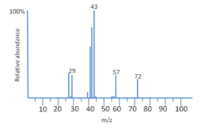

# midtermReview
Jan 12 2022
***
# Atomic Structure and Properties
## Concepts  
1. Moles and Molar Mass
 - 6.02x10^-23 atoms/mole
 - 
2. Mass Spec of Elements
 - Determines isotopes
 - Relative abundances weighted averages
 - 
 - Highest(most common isotope) peak = base peak 
 - z=-1 vaporized ions passed thru magnet, move more = lighter 

3. Classification of matter
 - Mixture/Pure Substance(can it be separated)
   - Mixture: Homogeneous(solution) if uniform composition, heterogeneous if not
     - Purity: $\frac{mass\ wanted\ substance}{mass\ total\ sample}$
   - Pure Sub: Compound if can be decomposed, Element if can't be
 - Hydrates(compounds)$Na_2CO_3\cdot H_2O$ - Water in ionic lattice 
 - Chemical Formula gives ratio of atoms present in a substance(of moles & mass), Empirical is lowest ratio 
 - **Law of definite proportions** - (Mass and Mole ratio constant)
4. Atomic Structure and Electron Configuration 
 - **Coulomb's law** - $F=k\frac{q_1q_2}{r^2}$
 - More non-valence e- = more shielding of nuclear charge on valence e-
 - Pauli Exclusion(spin/addresses), Aufbau(lowest orbitals first), Hund(spread out before 2 in any orbital) 
5. Photoelectron Spectroscopy 
 - Gaseous sample hit w/ UV/X-ray, nrg it takes to remove e- shows nrg lvl 
 - 
 - Each peak is subshell, height is relative #e-, nrg inc w/ aufbau shortcut
6. Periodic Trends 
  - Use Shielding and Radius to justify all changes(and shielding to justify radius)
 - Ionization Nrg - Closer = Greater = Harder to pull e- away 
 - Metals/Metalloids/Nonmetals 
7. Valence e- and Ionic Compounds 
## Problems 

# Molecular and Ionic Compound Structure and Properties 
1. Types of Chemical Bonds 
2. Intramolecular Force and Potential Energy 
3. Structure of Ionic Solids
4. Structure of Metals and Alloys
5. Lewis Diagrams 
6. Resonance and Formal Charge 
7. VSEPR and Bond Hybridization 

# Intramolecular Forces and Properties
1. Intermolecular Forces 
2. Properties of Solids 
3. Solids, Liquids, and Gases
4. Ideal Gas Law 
5. Kinetic Molecular Theory 
6. Deviation from Ideal Gas Law 
7. Solutions and Mixtures 
8. Representations of Solutions 
9. Separation of Solutions and Mixtures Chromatography 
10. Solubility 
11. Spectroscopy and the em Spectrum 
12. Photoelectric Effect 
13. Beer-Lambert Law

# Chemical Reactions 
1. Introduction for reactions 
2. Net Ionic Equations 
3. Representations of Reactions 
4. Physical and Chemical Changes 
5. Stoichiometry
6. Introduction to Titration 
7. Types of Chemical Reactions 
8. Introduction to Acid-Base Reactions 
9. Oxidation-Reduction (Redox) Reactions 

# Kinetics 
1. Reaction Rates 
2. Introduction to Rate Law 
3. Concentration Changes Over Time
4. Elementary Reactions 
5. Collision Model
6. Reaction Energy Profile 
7. Introduction to Reaction Mechanisms 
8. Reaction Mechanism and Rate Law 
9. Stead-State Approximation 
10. Multistep Reaction Energy Profile 
11. Catalysis 
